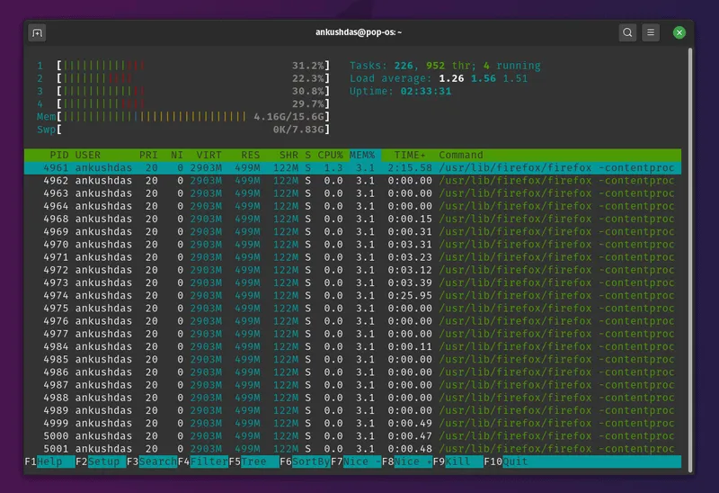
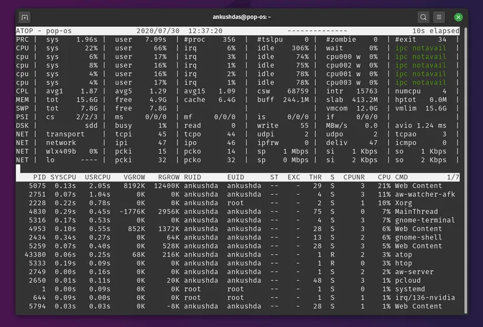
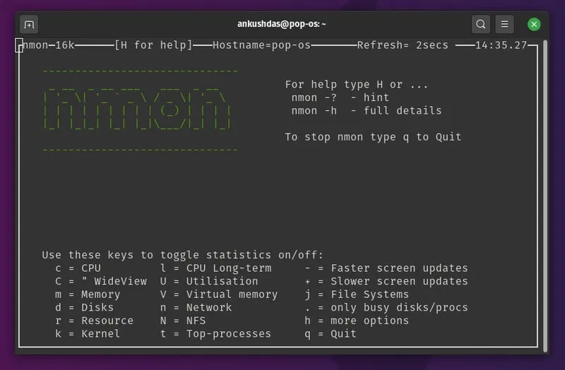
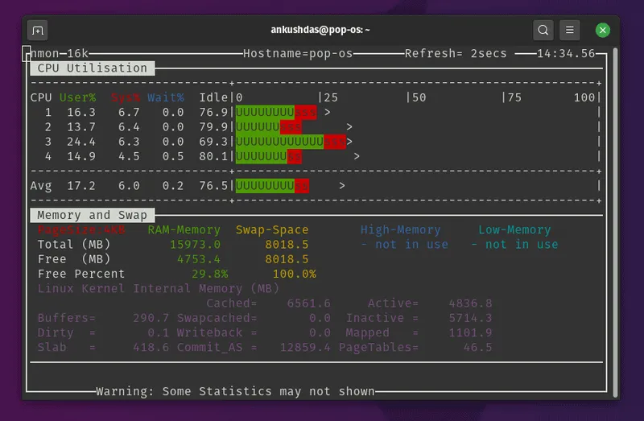
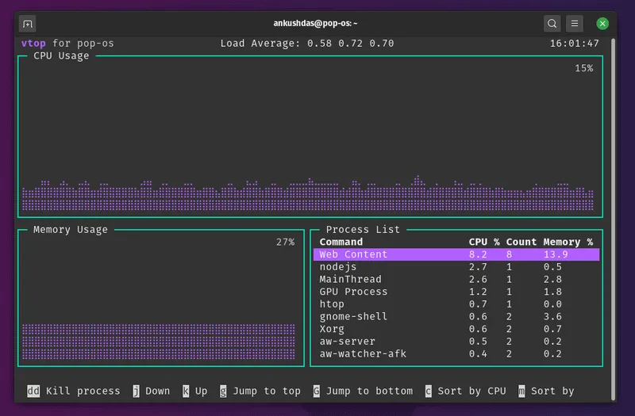
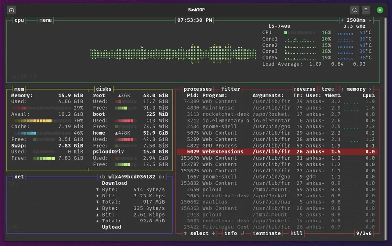
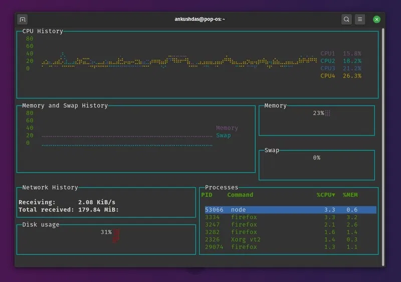
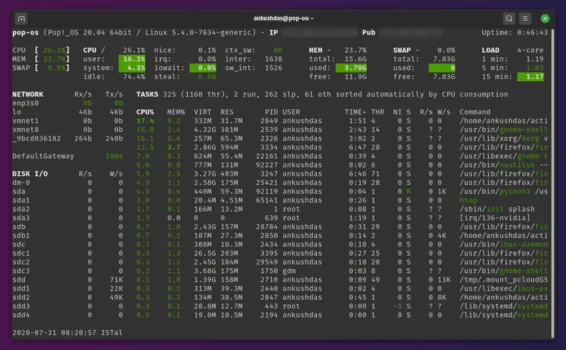

System Monitoring Tools for Linux 
---

# htop 



htop is an interactive system monitor that supports scrolling and mouse interaction as well.
Not just limited to the advanced features — but it also highlights the processes and information using some color codes which makes it look more organized and easy to work with.
In fact, I personally prefer using htop over top to keep an eye on the system resources and the processes. It lets you kill processes, filter them, offers tree view of processes (press F5), and a couple of other features.
How to install htop?
For Ubuntu-based distros, you just have to head to the terminal and type in:

```shell
sudo apt install htop
```

You can also find RPM/DEB packages from the links on their official website for other Linux distributions. In either case, you can also download the source if you want.


# atop 



If you want more details on the running processes or the ones that were previously running, atop is a useful utility for that.

It also supports permanent logging of resource utilization if you want it for long-term analysis. Even though I’m not a professional system administrator, it’s easy to say how useful it is to see the critical resource being highlighted.

I’d prefer htop over this — but it depends on what information you’re looking to monitor and what are the extra features that you want. 
You can learn more about it on its official website.

How to install atop?
If you’re on a Debian-based distro, you just have to type in:

```shell
sudo apt install atop
```

You can also find .rpm packages listed for every version on their official download page. In case you’re looking to install it on other Linux distros, you should refer to its official web page.

# nmon 



nmon is yet another useful utility that lets you monitor system resources and processes.

Unlike some other options, it gives you control to break down the information and display them one by one (toggle them) as needed.



As you can observe in the screenshots above, you have to press specific keys to toggle stats and look through them. The stats are color-coded as well, which makes them easy to go through.

How to install nmon?
For Ubuntu-based distros, you can simply type in:

```shell
sudo apt install nmon
```

In either case, you can head to its official download page and look for packages for other Linux distros.


# vtop



vtop is an interesting utility to monitory system resources while having the ability to manage them as well.

Unlike others, it is written using node.js. So, you’ll need to install node.js and npm packages.

It does offer mouse support and it looks like a GUI in a terminal. You can disable the mouse control if you don’t need it. So, it makes things easier to understand and monitor. Also, you can customize the vtop theme pretty easily.

How to install vtop?
For Ubuntu-based distros, you need to enter the following commands in the terminal

```shell
sudo apt install nodejs
sudo apt install npm
sudo npm install -g vtop
```

Here, you’re installing nodejs and its package manager npm first. Next, with the third command, you’re actually installing vtop.

If you want to install it on other Linux distributions, you can refer to its GitHub page.

# bashtop



An impressive top alternative which potentially needs more resources to run — but easy-to-use and looks better in my opinion.

I’m starting to think that I should use bashtop instead of htop for monitoring.

In addition to the information it offers by default, you can also add more modules if you also want CPU temperatures and other stats using bashtop.

You can get all the details on it at its GitHub page.

How to install bashtop?
For some reason, it isn’t available in the default repository of Ubuntu 20.04 – but if you have Ubuntu 20.10 or later, you can simply type in:

```shell
sudo apt install bashtop
```

For Ubuntu 20.04 or lower (any Ubunty-based distro), you can simply add the PPA and get it installed using the following commands:

```shell
sudo add-apt-repository ppa:bashtop-monitor/bashtop
sudo apt update
sudo apt install bashtop
```

To get installation isntructions for other Linux distributions, you can check out the GitHub page.

# gtop



Yet another impressive top alternative. It looks somewhat similar to vtop and also needs nodejs to be installed.

You don’t get much to customize here — but it’s easy to use and provides all the necessary information.

How to install gtop?
Similar to vtop, you need to install nodejs and npm package manager to get started on Ubuntu-based distros.

Just type in the following commands in the terminal to get it installed:

```shell
sudo apt install nodejs
sudo apt install npm
sudo npm install -g gtop
```

If you need to install it on any other Linux distro, you can refer to its GitHub page.

# Glances



Glances is an amazing system monitoring tool for folks who need to have more information at a single place.

The information you’ll have on your screen will depend on the size of the window. So, you should expect all the essential stats for disk I/O, network, kernel version, sensors, and other information.

You can also export the stats to an external database and use a web interface to monitor remotely. This is particularly useful for the system administrators making a custom web dashboard of sorts.

How to install Glances?
For Ubuntu-based distros, you can simply type in:

```shell
sudo apt install glances
```

If you’re looking to install it on other Linux distributions, you can refer to its official website where you should find an auto install script or just explore its GitHub page.


